# 一、Consul 
Consul 是一个支持多数据中心分布式高可用的服务发现和配置共享的服务软件

> 参考链接：https://github.com/hashicorp/consul
> 文档链接：https://www.consul.io/docs

## （一）Consul提供的一些关键特性
```
service discovery：consul通过DNS或者HTTP接口使服务注册和服务发现变的很容易，一些外部服务
  
health checking：健康检测使consul可以快速的警告在集群中的操作。和服务发现的集成，可以防止请求转发到故障的服务上面
  
key/value storage：一个用来存储动态配置的系统。提供简单的HTTP接口，可以在任何地方操作

```
  
  


# 二、入门

## （一） 运行 consul
### 1. 运行官网 consul 入门
#### （1） 运行官网 consul 容器
#### （2） 运行成功后默认启动开发模式的 conusul agent
```
consul agent -data-dir=/consul/data -config-dir=/consul/config -dev -client 0.0.0.0
```


### 2. 运行自定义的 consul 集群
#### （1）docker-compose.yaml
```
consul_cluster/docker-compose.yaml
```

## （二）宿主机查看 ui: http://localhost:8500
> consul 对外提供的端口，不同的端口有不同的作用

| 端口           | 说明                    |
| ------------ | ---------------------- |
| TCP/8300     | 8300 端口用于服务器节点。客户端通过该端口 RPC 协议调用服务端节点。服务器节点之间相互调用 |
| TCP/UDP/8301 | 8301 端口用于单个数据中心所有节点之间的互相通信，即对 LAN 池信息的同步。它使得整个数据中心能够自动发现服务器地址，分布式检测节点故障，事件广播（如领导选举事件）。     |
| TCP/UDP/8302 | 8302 端口用于单个或多个数据中心之间的服务器节点的信息同步，即对 WAN 池信息的同步。它针对互联网的高延退进行了优化，能够实现数据中心请求。     |
| 8500 | 8500 端口基于 HTTP 协议，用于 API 接口或 WEB UI 访问。     |
| 8600 | 8600 端口作为 DNS 服务器，它使得我们可以通过节点名查询节点信息。     |

### 1. 官网运行部分截图
**services**
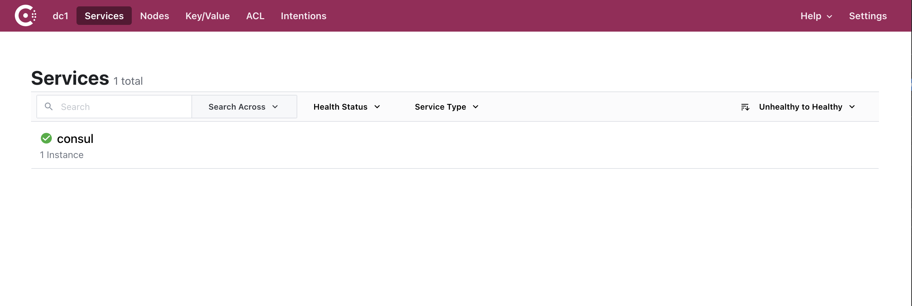

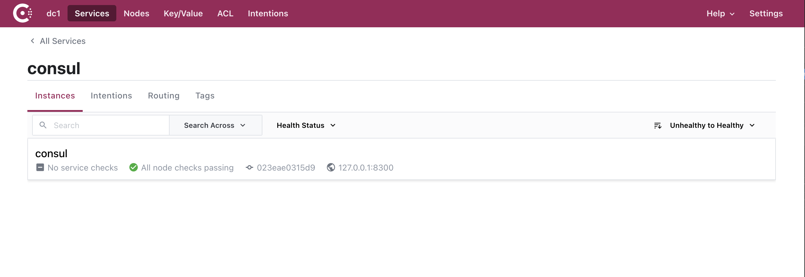

**nodes**
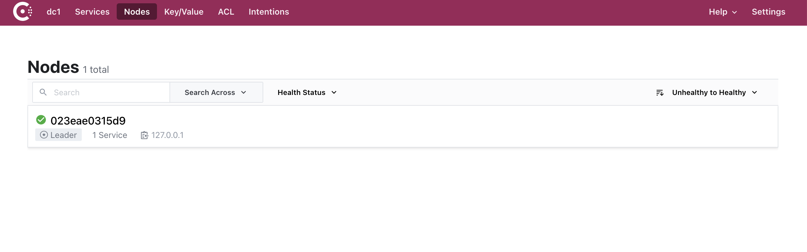

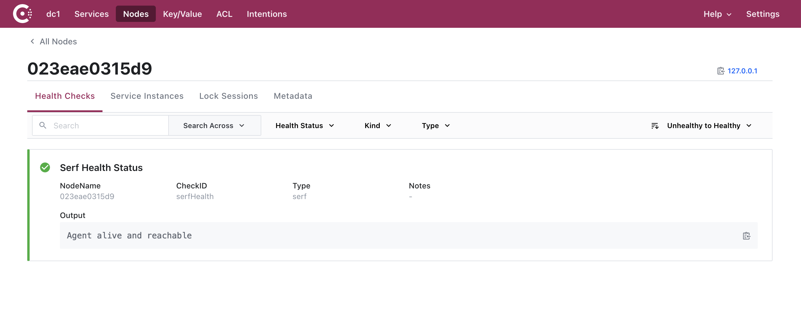


### 2. ./consul_cluster 运行 consul 集群部分截图
**services**
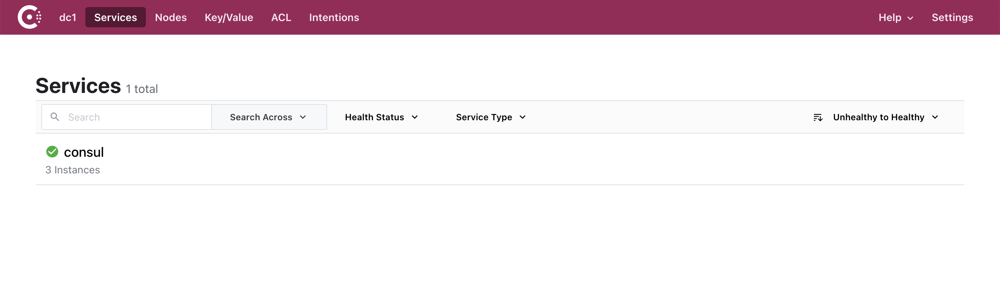

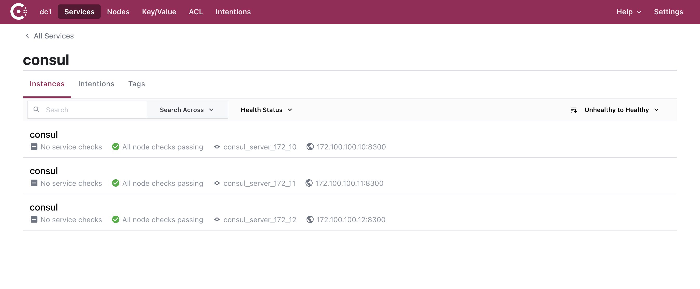

**nodes**
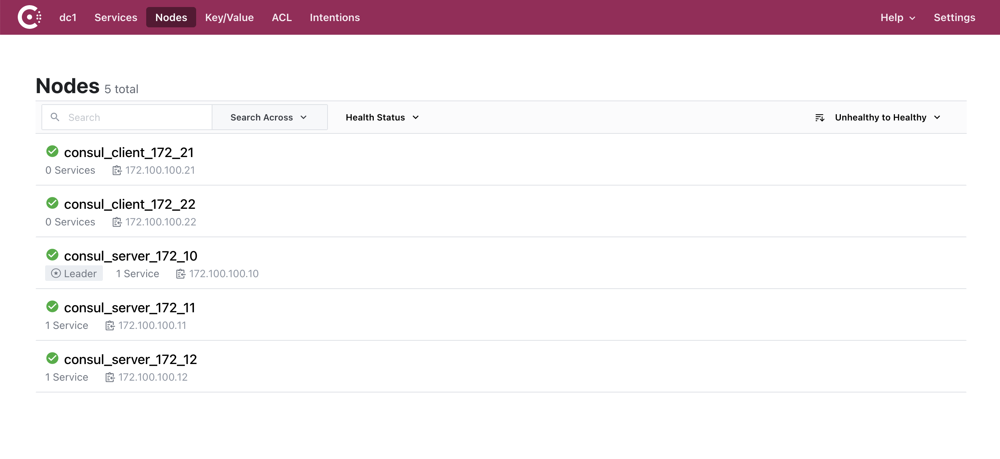

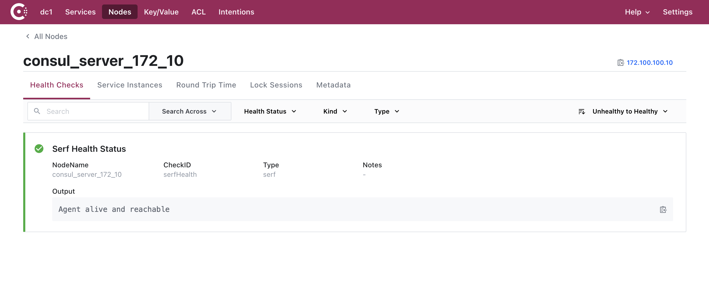

## （三） 使用 consul api 命令操作服务
> 参考链接：https://www.consul.io/api-docs/agent/service
### 1. 添加服务
> curl 请求示例
> > Name: 必填项。其他非必填，当 ID 不填时默认 ID == Name
> > 允许存在不同的ID, 相同的Name, ; 当创建相同的ID时会覆盖创建
```
curl -X PUT -d '{"ID":"order_1","Name":"order","Tags":["xdp-\/core.order"],"Address":"192.168.0.103","Port":18300,"Check":{"name":"order_1.check","tcp":"192.168.0.103:18300","interval":"10s","timeout":"2s"}}' http://localhost:8500/v1/agent/service/register
```

> 示例添加服务: 添加 ./tcp/service 下的 go 服务

- 1 在 main.go 中配置以下字段
```
	// 官网 consul
	consulRegisterUrl string = "http://127.0.0.1:8500/v1/agent/service/register" // 该 go tcp 运行在宿主机中，并且 consul 已与宿主机端口绑定
	// 自定义 consul 集群
	// consulRegisterUrl string = "http://127.0.0.1:8510/v1/agent/service/register" // 该 go tcp 运行在宿主机中，并且 consul 已与宿主机端口绑定
	consulRegisterThisId string = "go-tcp-service-001"
	consulRegisterThisName string = "go-tcp-service"
	consulRegisterThisAddress string = "192.168.0.103" // consul 运行在容器中，需要发现该服务，所以需要宿主机地址
	consulRegisterThisPort int = 8200 // consul 运行在容器中，需要发现该服务，所以需要宿主机地址
```
- 2 运行 main.go 即自动运行 init 方法将该 go 服务添加到到 consul 中

```
$ cd ./tcp/server
$ go run main.go
```

- 3 官网 consul 添加服务的效果
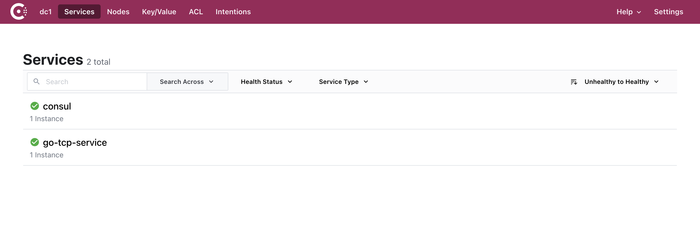


- 4 自定义 consul 集群添加服务的效果

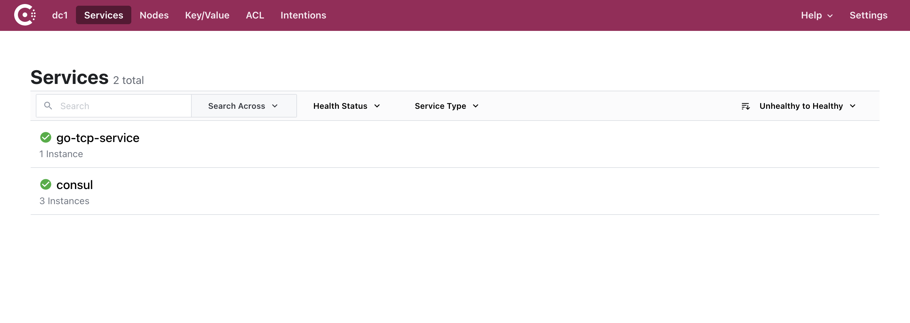

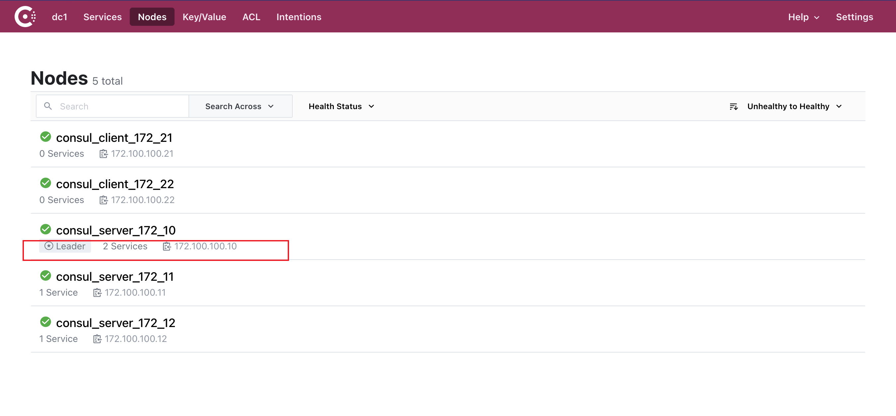

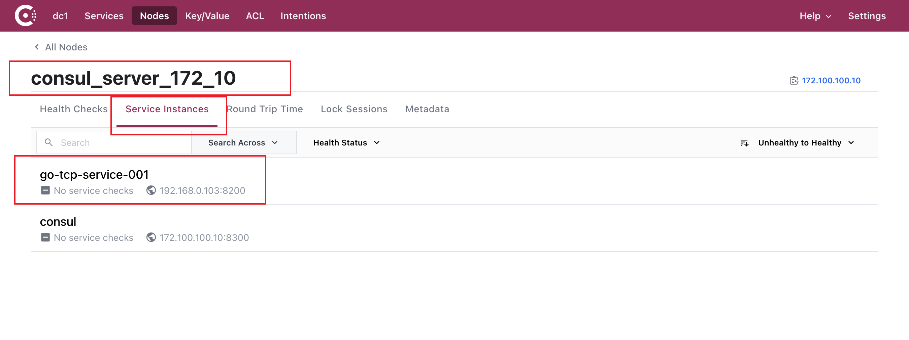

### 2. 查看所有服务
> curl 示例
```
curl http://localhost:8500/v1/agent/services
```

### 3. 查询服务-根据服务名查询
> curl 示例
```
curl http://localhost:8500/v1/health/service/{服务名}
```

### 4. 注销服务
> curl 示例
```
curl -X PUT http://localhost:8500/v1/agent/service/deregister/{服务ID}
```


### 5. key / value 存储

有两种方式与 Consul KV 存储交互： Consul CLI 和 UI。 官网使用 CLI 的方式。 在本教程中，使用 Consul UI 的 Restful API 方式

> Consul UI 的方式还可以直接在 localhost:8500 页面中操作

#### （1）添加 key/value
> CURL 示例
```
curl -X PUT -d '{vlaue}' http://localhost:8500/v1/kv/{key}
```

#### （2）查看所有 key
> curl 示例
```
curl http://localhost:8500/v1/kv/?recurse
```

#### （3）查看单个 key
> curl 示例
```
curl http://localhost:8500/v1/kv/{key}
```

#### （4）修改 key/value
> curl 示例
```
curl -X PUT -d '{value}' http://localhost:8500/v1/kv/{key}
```

#### （5）删除 key
> curl 示例
```
curl -X DELETE  http://localhost:8500/v1/kv/{key}
```


## （四）consul 命令操作

### 1. 发现数据中心成员
```
consul members [-detailed]
``` 

### 2. 重启 consul
```
consul reload
```

### 3. 优雅地停止代理 consul agent
```
consul leave
```

### 4. 服务
> 参考链接：https://www.consul.io/commands/services
#### （1）查看服务列表
```
consul catalog services
```

#### （2）注册服务
```
consul services register -name=test
```


#### （3）注销服务
```
consul services deregister -id test
```


# 三、其他

### consul 集群架构.png


### consul 集群

Consul 是一个分布式的解决方案，可以部署多个 Consul 实例，确保数据中心的持续稳定，在 Consul 集群中，内部采用投票的方式选举出 leader，然后才开始运行整个集群，只有正确选举出 leader 后，集群才开始工作，当一个服务注册到 Consul 后，集群将该服务进行同步，确保 Consul 集群内的每个节点都存储了该服务的信息；然后，Consul 集群将对该服务进行健康检查和投票，超过半数通过，即认为该服务为正常（或者异常）；一旦被投票认定为异常的服务，该服务将不会被外部发现（不可访问），在此过程中，Consul 将持续的对该异常的服务进行检查，一旦服务恢复，Consul 即刻将其加入正常服务。
简单来说：consul内部已经包含选举，服务治理等了。


### server 和 client 模式
Consul 支持两种运行的方式，即 server 和 client 模式，当一个 Consul 节点以 server 模式运行的时候，就表示该 Consul 节点会存储服务和配置等相关信息，并且参与到健康检查、leader 选举等服务器事务中，与之相反的是，client 模式不会存储服务信息

### 数据中心
每个Consul节点都需要加入一个命名的数据中心(DataCenter) ， -个节点上,可以运行多个 数据中心，数据中心的作用在于应用隔离,相当于服务分组。可以简单理解为, -个数据中心 域为一个二层联通的子网。